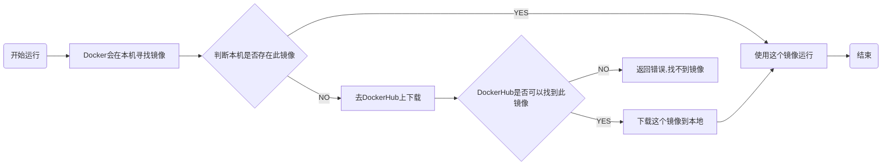

### Docker安装

> 环境准备

CentOS 7

> 环境查看

```shell
#系统内核是 3.10以上的
# uname -r
3.10.0-514.26.2.el7.x86_64
```

```shell
#系统版本
# cat /etc/os-release 
NAME="CentOS Linux"
VERSION="7 (Core)"
ID="centos"
ID_LIKE="rhel fedora"
VERSION_ID="7"
PRETTY_NAME="CentOS Linux 7 (Core)"
ANSI_COLOR="0;31"
CPE_NAME="cpe:/o:centos:centos:7"
HOME_URL="https://www.centos.org/"
BUG_REPORT_URL="https://bugs.centos.org/"

CENTOS_MANTISBT_PROJECT="CentOS-7"
CENTOS_MANTISBT_PROJECT_VERSION="7"
REDHAT_SUPPORT_PRODUCT="centos"
REDHAT_SUPPORT_PRODUCT_VERSION="7"
```

> 安装

帮助文档：

```shell
#1、卸载旧版本
#yum remove docker \
                  docker-client \
                  docker-client-latest \
                  docker-common \
                  docker-latest \
                  docker-latest-logrotate \
                  docker-logrotate \
                  docker-engine
#2、需要的安装包
#yum install -y yum-utils

#3、设置镜像的仓库
yum-config-manager \
    --add-repo \
    https://download.docker.com/linux/centos/docker-ce.repo#默认是国外的，不要用这个！
#yum-config-manager --add-repo http://mirrors.aliyun.com/docker-ce/linux/centos/docker-ce.repo #推荐使用

#更新yum软件包索引
#yum makecache fast


#4、安装Docker相关的包	docker-ce 社区版 docker-ee	企业版
#yum install docker-ce docker-ce-cli containerd.io

#5、启动docker
#systemctl start docker

#使用docker version查看是否安装成功
#docker version

Client: Docker Engine - Community
 Version:           19.03.12
 API version:       1.40
 Go version:        go1.13.10
 Git commit:        48a66213fe
 Built:             Mon Jun 22 15:46:54 2020
 OS/Arch:           linux/amd64
 Experimental:      false

Server: Docker Engine - Community
 Engine:
  Version:          19.03.12
  API version:      1.40 (minimum version 1.12)
  Go version:       go1.13.10
  Git commit:       48a66213fe
  Built:            Mon Jun 22 15:45:28 2020
  OS/Arch:          linux/amd64
  Experimental:     false
 containerd:
  Version:          1.2.13
  GitCommit:        7ad184331fa3e55e52b890ea95e65ba581ae3429
 runc:
  Version:          1.0.0-rc10
  GitCommit:        dc9208a3303feef5b3839f4323d9beb36df0a9dd
 docker-init:
  Version:          0.18.0
  GitCommit:        fec3683


#7、测试hello world
#docker run hello-world

Unable to find image 'hello-world:latest' locally
latest: Pulling from library/hello-world
0e03bdcc26d7: Pull complete 
Digest: sha256:7f0a9f93b4aa3022c3a4c147a449bf11e0941a1fd0bf4a8e6c9408b2600777c5
Status: Downloaded newer image for hello-world:latest

Hello from Docker!
This message shows that your installation appears to be working correctly.

To generate this message, Docker took the following steps:
 1. The Docker client contacted the Docker daemon.
 2. The Docker daemon pulled the "hello-world" image from the Docker Hub.
    (amd64)
 3. The Docker daemon created a new container from that image which runs the
    executable that produces the output you are currently reading.
 4. The Docker daemon streamed that output to the Docker client, which sent it
    to your terminal.

To try something more ambitious, you can run an Ubuntu container with:
 $ docker run -it ubuntu bash

Share images, automate workflows, and more with a free Docker ID:
 https://hub.docker.com/

For more examples and ideas, visit:
 https://docs.docker.com/get-started/

#8、查看一下下载的这个hello-world镜像
#docker images
REPOSITORY          TAG                 IMAGE ID            CREATED             SIZE
hello-world         latest              bf756fb1ae65        8 months ago        13.3kB

```


> 卸载

```shell
yum remove docker-ce docker-ce-cli containerd.io	#卸载依赖
rm -rf /var/lib/docker	#删除资源

#/var/lib/docker	docker的默认资源路径
```


#### 阿里云镜像加速

1、登陆阿里云，找到容器镜像服务


2、找到镜像加速器


3、配置使用

```shell
sudo mkdir -p /etc/docker
sudo tee /etc/docker/daemon.json <<-'EOF'
{
  "registry-mirrors": ["https://swt8v02e.mirror.aliyuncs.com"]
}
EOF
sudo systemctl daemon-reload
sudo systemctl restart docker
```


#### 回顾hello-world流程




#### 底层原理

> Docker是怎么工作的？

Docker是一个C/S结构的系统，Docker的守护进程运行在宿主机上。通过Socket从客户端访问。


> Docker为什么比虚拟机更快？

Docker有着比虚拟机更少的抽象层。即，Docker利用的是宿主机的内核，而虚拟机需要Guest OS。所以新建一个容器时，Docker不需要像虚拟机一样重新加载一个操作系统内核，避免很多引导的过程。加载是秒级的！


### Docker常用命令


#### 帮助命令

```shell
docker version	#docker的版本信息
docker info			#docker的系统信息，包括镜像和容器的数量
docker 命令 --help
```

命令的文档地址：https://docs.docker.com/reference/


#### 镜像命令

**docker images**		查看本地主机上所有的镜像

```shell
# docker images
REPOSITORY          TAG                 IMAGE ID            CREATED             SIZE
hello-world         latest              bf756fb1ae65        8 months ago        13.3kB

#解释
REPOSITORY	镜像的仓库源
TAG					镜像的标签
IMAGE ID		镜像的ID
CREATE			镜像的创建时间
SIZE				镜像的大小

#可选项
  -a, --all            	#列出所有镜像
  -q, --quiet           #只显示镜像的ID
```

**docker search**	搜索镜像

```shell
# docker search mysql
NAME                              DESCRIPTION                                     STARS               OFFICIAL            AUTOMATED
mysql                             MySQL is a widely used, open-source relation…   9925                [OK]                
mariadb                           MariaDB is a community-developed fork of MyS…   3631                [OK]                

#可选项
  -f, --filter filter   Filter output based on conditions provided
  例如 --filter=STARS=3000	搜索出来的镜像就是STARS大于3000的
```

**Docker pull**	下载镜像

```shell
# docker pull mysql		#docker pull 镜像名[:tag]
Using default tag: latest	#如果不写tag，默认就是latest版本
latest: Pulling from library/mysql
bf5952930446: Pull complete 	#分层下载，docker image的核心	联合文件系统
8254623a9871: Pull complete 
938e3e06dac4: Pull complete 
ea28ebf28884: Pull complete 
f3cef38785c2: Pull complete 
894f9792565a: Pull complete 
1d8a57523420: Pull complete 
6c676912929f: Pull complete 
ff39fdb566b4: Pull complete 
fff872988aba: Pull complete 
4d34e365ae68: Pull complete 
7886ee20621e: Pull complete 
Digest: sha256:c358e72e100ab493a0304bda35e6f239db2ec8c9bb836d8a427ac34307d074ed	#签名
Status: Downloaded newer image for mysql:latest	
docker.io/library/mysql:latest	#真实地址

#命令docker pull mysql 与 docker.io/library/mysql:latest 等价

#指定版本下载
# docker pull mysql:5.7
5.7: Pulling from library/mysql
bf5952930446: Already exists 
8254623a9871: Already exists 
938e3e06dac4: Already exists 
ea28ebf28884: Already exists 
f3cef38785c2: Already exists 
894f9792565a: Already exists 
1d8a57523420: Already exists 
5f09bf1d31c1: Pull complete 
1b6ff254abe7: Pull complete 
74310a0bf42d: Pull complete 
d398726627fd: Pull complete 
Digest: sha256:da58f943b94721d46e87d5de208dc07302a8b13e638cd1d24285d222376d6d84
Status: Downloaded newer image for mysql:5.7
docker.io/library/mysql:5.7
```

**docker rmi**	删除镜像

```shell
Options:
  -f, --force      Force removal of the image
      --no-prune   Do not delete untagged parents

# docker rmi -f 718a6da099d8
Untagged: mysql:5.7
Untagged: mysql@sha256:da58f943b94721d46e87d5de208dc07302a8b13e638cd1d24285d222376d6d84
Deleted: sha256:718a6da099d82183c064a964523c0deca80619cb033aadd15854771fe592a480
Deleted: sha256:058d93ef2bfb943ba6a19d8b679c702be96e34337901da9e1a07ad62b772bf3d
Deleted: sha256:7bca77783fcf15499a0386127dd7d5c679328a21b6566c8be861ba424ac13e49
Deleted: sha256:183d05512fa88dfa8c17abb9b6f09a79922d9e9ee001a33ef34d1bc094bf8f9f
Deleted: sha256:165805124136fdee738ed19021a522bb53de75c2ca9b6ca87076f51c27385fd7

删除所有镜像
root@izbp1g4zldn8zzaga4gpidz: ~ 15:07:24
# docker rmi -f $(docker images -aq)
Untagged: mysql:latest
Untagged: mysql@sha256:c358e72e100ab493a0304bda35e6f239db2ec8c9bb836d8a427ac34307d074ed
Deleted: sha256:0d64f46acfd1af4ee6a162f80c6e07e843761bf14d412060023bf0e69e720fb4
Deleted: sha256:308fb4d64e5d57094fcd70bd946f9f842a1de6b596a4807787f01dc181c76b18
Deleted: sha256:fbc8e9508f704f46bfe3607ce4523aac7758757a9752a44a40221c2d353b7147
Deleted: sha256:d55db5e278c81c9cf5b51cc63f5ba9c5d9a616f6e28f9ce25b3545ff58298a89
Deleted: sha256:c2596316288a83e50e7e922d18b5f86b8ce34915c6f58c239f093cb514016538
Deleted: sha256:cfe5cd376e0ee9cb83864690a8971646a774ed189bda11f5a39e8bb0e71d77f9
Deleted: sha256:904abdc2d0bea0edbb1a8171d1a1353fa6de22150a9c5d81358799a5b6c38c8d
Deleted: sha256:d26f7649f78cf789267fbbca8aeb234932e230109c728632c6b9fbc60ca5591b
Deleted: sha256:7fcf7796e23ea5b42eb3bbd5bec160ba5f5f47ecb239053762f9cf766c143942
Deleted: sha256:826130797a5760bcd2bb19a6c6d92b5f4860bbffbfa954f5d3fc627904a76e9d
Deleted: sha256:53e0181c63e41fb85bce681ec8aadfa323cd00f70509107f7001a1d0614e5adf
Deleted: sha256:d6854b83e83d7eb48fb0ef778c58a8b839adb932dd036a085d94a7c2db98f890
Deleted: sha256:d0f104dc0a1f9c744b65b23b3fd4d4d3236b4656e67f776fe13f8ad8423b955c
Error response from daemon: conflict: unable to delete bf756fb1ae65 (must be forced) - image is being used by stopped container cb0a51692b28#因为忘了加-f，所以hello-world没删掉
```


#### 容器命令

> 说明：有了镜像才可以创建容器。

下载centos镜像

```shel
docker pull centos
```

**docker run [options] image**	新建容器并启动

```shell
#参数说明
--name="Name"		#容器名字		tomcat01, tomcat02...
-d							#后台方式运行
-it							#使用交互方式运行，进入容器查看内容
-p							#指定容器的端口，-p 8080:8080
		-p	ip:主机端:容器端口
		-p	主机端:容器端口（常用）
		-p	容器端口
-P							#随机指定端口


#测试：启动并进入容器
# docker run -it centos /bin/bash
[root@e530d9f586b0 /]# 
[root@e530d9f586b0 /]# ls	#查看容器内的centos，基础版本，很多命令是不完善的
bin  dev  etc  home  lib  lib64  lost+found  media  mnt  opt  proc  root  run  sbin  srv  sys  tmp  usr  var
[root@e530d9f586b0 /]# exit
```

**docker ps**	列出所有运行中的容器

```shell
# docker ps
CONTAINER ID        IMAGE               COMMAND             CREATED             STATUS              PORTS               NAMES
root@izbp1g4zldn8zzaga4gpidz: ~ 21:56:29

# docker ps -a	#列出所有运行过的容器
CONTAINER ID        IMAGE               COMMAND             CREATED             STATUS                          PORTS               NAMES
e530d9f586b0        centos              "/bin/bash"         3 minutes ago       Exited (0) About a minute ago                       jovial_goldberg
9926505823d6        hello-world         "/hello"            11 hours ago        Exited (0) 11 hours ago                             funny_babbage
cb0a51692b28        hello-world         "/hello"            11 hours ago        Exited (0) 11 hours ago                             zen_jackson

# docker ps -a -n=1	#显示最近创建的n个容器
CONTAINER ID        IMAGE               COMMAND             CREATED             STATUS                     PORTS               NAMES
e530d9f586b0        centos              "/bin/bash"         7 minutes ago       Exited (0) 5 minutes ago                       jovial_goldberg

# docker ps -aq	#只显示编号
e530d9f586b0
9926505823d6
cb0a51692b28
```

**exit** 	容器停止并退出

**Ctrl + P + Q**	容器不停止并退出

```shell
# docker run -it centos /bin/bash
[root@cd82fcb3f8b3 /]# 
[root@cd82fcb3f8b3 /]# 
[root@cd82fcb3f8b3 /]# 
[root@cd82fcb3f8b3 /]# 
[root@cd82fcb3f8b3 /]# ls
bin  dev  etc  home  lib  lib64  lost+found  media  mnt  opt  proc  root  run  sbin  srv  sys  tmp  usr  var
#Ctrl + P + Q
[root@cd82fcb3f8b3 /]# root@izbp1g4zldn8zzaga4gpidz: ~ 10:10:18
# 
root@izbp1g4zldn8zzaga4gpidz: ~ 10:10:44
# docker ps
CONTAINER ID        IMAGE               COMMAND             CREATED             STATUS              PORTS               NAMES
cd82fcb3f8b3        centos              "/bin/bash"         45 seconds ago      `Up 44 seconds`                           interesting_moser
```


**docker rm**	删除容器

```shell
#docker rm 容器id
root@izbp1g4zldn8zzaga4gpidz: ~ 10:16:47
# docker rm e530d9f586b0
e530d9f586b0
root@izbp1g4zldn8zzaga4gpidz: ~ 10:17:03
# docker ps -a
CONTAINER ID        IMAGE               COMMAND             CREATED             STATUS                  PORTS               NAMES
cd82fcb3f8b3        centos              "/bin/bash"         7 minutes ago       Up 7 minutes                                interesting_moser
9926505823d6        hello-world         "/hello"            3 days ago          Exited (0) 3 days ago                       funny_babbage
cb0a51692b28        hello-world         "/hello"            3 days ago          Exited (0) 3 days ago                       zen_jackson
root@izbp1g4zldn8zzaga4gpidz: ~ 10:17:07
# docker rm cd82fcb3f8b3	#运行中的容器无法删除，除非使用-f参数
Error response from daemon: You cannot remove a running container cd82fcb3f8b3b23818ae1ce63f663c1e8c67479faf8d8f5f21034b6695f604cf. Stop the container before attempting removal or force remove

# docker rm -f $(docker ps -aq)	删除所有容器
# docker ps -a -q | xargs docker rm 删除所有容器
cd82fcb3f8b3
9926505823d6
cb0a51692b28
root@izbp1g4zldn8zzaga4gpidz: ~ 10:19:58
# docker ps -a
CONTAINER ID        IMAGE               COMMAND             CREATED             STATUS              PORTS               NAMES
```

**启动和停止容器**

```shell
docker start 容器id
docker restart 容器id
docker stop 容器id
docker kill 容器id	#强制停止当前容器

root@izbp1g4zldn8zzaga4gpidz: ~ 10:41:09
# docker start 87ad6d6efc21
87ad6d6efc21
root@izbp1g4zldn8zzaga4gpidz: ~ 10:41:20
# docker ps
CONTAINER ID        IMAGE               COMMAND             CREATED             STATUS              PORTS               NAMES
87ad6d6efc21        centos              "/bin/bash"         42 seconds ago      Up 3 seconds                            cool_banach
root@izbp1g4zldn8zzaga4gpidz: ~ 10:41:24
# docker stop 87ad6d6efc21
87ad6d6efc21
root@izbp1g4zldn8zzaga4gpidz: ~ 10:41:31
# docker ps
CONTAINER ID        IMAGE               COMMAND             CREATED             STATUS              PORTS               NAMES

```


#### 常用的其他命令

**docker run -d image**	后台启动

```shell
root@izbp1g4zldn8zzaga4gpidz: ~ 10:47:50
# docker run -d centos
edeb19029dd77224fbc907eb04015d90d236b693e79f0c70cf7af78c6aca09c7
root@izbp1g4zldn8zzaga4gpidz: ~ 10:47:57
# docker ps	#发现centos自动停止了
CONTAINER ID        IMAGE               COMMAND             CREATED             STATUS              PORTS               NAMES

#原因：docker容器使用后台运行，就必须有一个前台进程，docker发现没有应用就会自动停止。
```

**docker logs	容器id**	查看日志

```shell
# docker logs -f -t 87ad6d6efc21
2020-09-07T02:40:43.408775942Z [root@87ad6d6efc21 /]# 
2020-09-07T02:40:43.603515448Z [root@87ad6d6efc21 /]# 
2020-09-07T02:41:05.982233799Z [root@87ad6d6efc21 /]# exit
2020-09-07T02:41:30.963274673Z [root@87ad6d6efc21 /]# exit

#在centos中一直打印一句话
# docker run -d centos /bin/sh -c "while true;do echo create log;sleep 1;done"
9e43264449a9844efdd1d5a88709a3324f8b8873e66cff68712fa673739a8245
root@izbp1g4zldn8zzaga4gpidz: ~ 11:01:02
# docker ps
CONTAINER ID        IMAGE               COMMAND                  CREATED             STATUS              PORTS               NAMES
9e43264449a9        centos              "/bin/sh -c 'while t…"   4 seconds ago       Up 3 seconds                            awesome_williams
root@izbp1g4zldn8zzaga4gpidz: ~ 11:01:06
# docker logs -ft --tail 10 9e43264449a9
2020-09-07T03:01:22.550857185Z create log
2020-09-07T03:01:23.553130443Z create log
2020-09-07T03:01:24.555939941Z create log
2020-09-07T03:01:25.557498035Z create log
2020-09-07T03:01:26.559825971Z create log
2020-09-07T03:01:27.561935118Z create log
2020-09-07T03:01:28.564137697Z create log
2020-09-07T03:01:29.566464968Z create log
2020-09-07T03:01:30.569206119Z create log
2020-09-07T03:01:31.571437641Z create log
2020-09-07T03:01:32.573573616Z create log
```


**docker top 容器id**	查看容器内部的进程信息

```shell
# docker top 9e43264449a9
UID                 PID                 PPID                C                   STIME 
root                20615               20592               0                   15:27 
root                20717               20615               0                   15:27 

```


**docker inspect 容器id**	查看镜像元数据

```shell
# docker inspect 9e43264449a9
[
    {
        "Id": "9e43264449a9844efdd1d5a88709a3324f8b8873e66cff68712fa673739a8245",
        "Created": "2020-09-07T03:01:02.066625882Z",
        "Path": "/bin/sh",
        "Args": [
            "-c",
            "while true;do echo create log;sleep 1;done"
        ],
        "State": {
            "Status": "exited",
            "Running": false,
            "Paused": false,
            "Restarting": false,
            "OOMKilled": false,
            "Dead": false,
            "Pid": 0,
            "ExitCode": 137,
            "Error": "",
            "StartedAt": "2020-09-07T07:27:05.261105118Z",
            "FinishedAt": "2020-09-07T07:28:40.995386259Z"
        },
        "Image": "sha256:0d120b6ccaa8c5e149176798b3501d4dd1885f961922497cd0abef155c869566",
        "ResolvConfPath": "/var/lib/docker/containers/9e43264449a9844efdd1d5a88709a3324f8b8873e66cff68712fa673739a8245/resolv.conf",
        "HostnamePath": "/var/lib/docker/containers/9e43264449a9844efdd1d5a88709a3324f8b8873e66cff68712fa673739a8245/hostname",
        "HostsPath": "/var/lib/docker/containers/9e43264449a9844efdd1d5a88709a3324f8b8873e66cff68712fa673739a8245/hosts",
        "LogPath": "/var/lib/docker/containers/9e43264449a9844efdd1d5a88709a3324f8b8873e66cff68712fa673739a8245/9e43264449a9844efdd1d5a88709a3324f8b8873e66cff68712fa673739a8245-json.log",
        "Name": "/awesome_williams",
        "RestartCount": 0,
        "Driver": "overlay2",
        "Platform": "linux",
        "MountLabel": "",
        "ProcessLabel": "",
        "AppArmorProfile": "",
        "ExecIDs": null,
        "HostConfig": {
            "Binds": null,
            "ContainerIDFile": "",
            "LogConfig": {
                "Type": "json-file",
                "Config": {}
            },
            "NetworkMode": "default",
            "PortBindings": {},
            "RestartPolicy": {
                "Name": "no",
                "MaximumRetryCount": 0
            },
            "AutoRemove": false,
            "VolumeDriver": "",
            "VolumesFrom": null,
            "CapAdd": null,
            "CapDrop": null,
            "Capabilities": null,
            "Dns": [],
            "DnsOptions": [],
            "DnsSearch": [],
            "ExtraHosts": null,
            "GroupAdd": null,
            "IpcMode": "private",
            "Cgroup": "",
            "Links": null,
            "OomScoreAdj": 0,
            "PidMode": "",
            "Privileged": false,
            "PublishAllPorts": false,
            "ReadonlyRootfs": false,
            "SecurityOpt": null,
            "UTSMode": "",
            "UsernsMode": "",
            "ShmSize": 67108864,
            "Runtime": "runc",
            "ConsoleSize": [
                0,
                0
            ],
            "Isolation": "",
            "CpuShares": 0,
            "Memory": 0,
            "NanoCpus": 0,
            "CgroupParent": "",
            "BlkioWeight": 0,
            "BlkioWeightDevice": [],
            "BlkioDeviceReadBps": null,
            "BlkioDeviceWriteBps": null,
            "BlkioDeviceReadIOps": null,
            "BlkioDeviceWriteIOps": null,
            "CpuPeriod": 0,
            "CpuQuota": 0,
            "CpuRealtimePeriod": 0,
            "CpuRealtimeRuntime": 0,
            "CpusetCpus": "",
            "CpusetMems": "",
            "Devices": [],
            "DeviceCgroupRules": null,
            "DeviceRequests": null,
            "KernelMemory": 0,
            "KernelMemoryTCP": 0,
            "MemoryReservation": 0,
            "MemorySwap": 0,
            "MemorySwappiness": null,
            "OomKillDisable": false,
            "PidsLimit": null,
            "Ulimits": null,
            "CpuCount": 0,
            "CpuPercent": 0,
            "IOMaximumIOps": 0,
            "IOMaximumBandwidth": 0,
            "MaskedPaths": [
                "/proc/asound",
                "/proc/acpi",
                "/proc/kcore",
                "/proc/keys",
                "/proc/latency_stats",
                "/proc/timer_list",
                "/proc/timer_stats",
                "/proc/sched_debug",
                "/proc/scsi",
                "/sys/firmware"
            ],
            "ReadonlyPaths": [
                "/proc/bus",
                "/proc/fs",
                "/proc/irq",
                "/proc/sys",
                "/proc/sysrq-trigger"
            ]
        },
        "GraphDriver": {
            "Data": {
                "LowerDir": "/var/lib/docker/overlay2/3803dfd1d1fb4c18109de8e0d45a03d55ce0a810ba340c44eaa0d7866e61ca76-init/diff:/var/lib/docker/overlay2/2b34837f80f75599621cd1ae2109c171e19dffc9614dd2415605f8efd4b87350/diff",
                "MergedDir": "/var/lib/docker/overlay2/3803dfd1d1fb4c18109de8e0d45a03d55ce0a810ba340c44eaa0d7866e61ca76/merged",
                "UpperDir": "/var/lib/docker/overlay2/3803dfd1d1fb4c18109de8e0d45a03d55ce0a810ba340c44eaa0d7866e61ca76/diff",
                "WorkDir": "/var/lib/docker/overlay2/3803dfd1d1fb4c18109de8e0d45a03d55ce0a810ba340c44eaa0d7866e61ca76/work"
            },
            "Name": "overlay2"
        },
        "Mounts": [],
        "Config": {
            "Hostname": "9e43264449a9",
            "Domainname": "",
            "User": "",
            "AttachStdin": false,
            "AttachStdout": false,
            "AttachStderr": false,
            "Tty": false,
            "OpenStdin": false,
            "StdinOnce": false,
            "Env": [
                "PATH=/usr/local/sbin:/usr/local/bin:/usr/sbin:/usr/bin:/sbin:/bin"
            ],
            "Cmd": [
                "/bin/sh",
                "-c",
                "while true;do echo create log;sleep 1;done"
            ],
            "Image": "centos",
            "Volumes": null,
            "WorkingDir": "",
            "Entrypoint": null,
            "OnBuild": null,
            "Labels": {
                "org.label-schema.build-date": "20200809",
                "org.label-schema.license": "GPLv2",
                "org.label-schema.name": "CentOS Base Image",
                "org.label-schema.schema-version": "1.0",
                "org.label-schema.vendor": "CentOS"
            }
        },
        "NetworkSettings": {
            "Bridge": "",
            "SandboxID": "75b47312a00369cf2be77d7b9cb9a2506a484436cd8a2ebe8e7cb6bb4c5ffca7",
            "HairpinMode": false,
            "LinkLocalIPv6Address": "",
            "LinkLocalIPv6PrefixLen": 0,
            "Ports": {},
            "SandboxKey": "/var/run/docker/netns/75b47312a003",
            "SecondaryIPAddresses": null,
            "SecondaryIPv6Addresses": null,
            "EndpointID": "",
            "Gateway": "",
            "GlobalIPv6Address": "",
            "GlobalIPv6PrefixLen": 0,
            "IPAddress": "",
            "IPPrefixLen": 0,
            "IPv6Gateway": "",
            "MacAddress": "",
            "Networks": {
                "bridge": {
                    "IPAMConfig": null,
                    "Links": null,
                    "Aliases": null,
                    "NetworkID": "46f0736c698f41e145e744e0d1c2d9f37697bfd12b8d738defc44587417a2c42",
                    "EndpointID": "",
                    "Gateway": "",
                    "IPAddress": "",
                    "IPPrefixLen": 0,
                    "IPv6Gateway": "",
                    "GlobalIPv6Address": "",
                    "GlobalIPv6PrefixLen": 0,
                    "MacAddress": "",
                    "DriverOpts": null
                }
            }
        }
    }
]

```


**docker exec -it 容器id bashShell**	进入当前正在运行的容器（新开终端）

```shell
#我们通常容器都是使用后台方式运行的，需要进入容器，修改一些配置

root@izbp1g4zldn8zzaga4gpidz: ~ 15:44:44
# docker exec -it 9e43264449a9 /bin/bash
[root@9e43264449a9 /]# ps -ef
UID        PID  PPID  C STIME TTY          TIME CMD
root         1     0  0 07:44 ?        00:00:00 /bin/sh -c while true;do echo create log;sleep 1;done
root        31     0  0 07:45 pts/0    00:00:00 /bin/bash
root        54     1  0 07:45 ?        00:00:00 /usr/bin/coreutils --coreutils-prog-shebang=sleep /usr/bin/sleep 1
root        55    31  0 07:45 pts/0    00:00:00 ps -ef
```

**docker attack 容器id**	进入当前正在运行的容器（进入已有终端）

```shell
# docker attach 9e43264449a9
create log
create log
create log
...
```

**docker cp 容器id:容器内路径**	从容器内拷贝文件到主机上

```shell
root@izbp1g4zldn8zzaga4gpidz: ~ 15:59:17
# docker run -it centos /bin/bash
[root@69167b28997f /]# ls
bin  dev  etc  home  lib  lib64  lost+found  media  mnt  opt  proc  root  run  sbin  srv  sys  tmp  usr  var
[root@69167b28997f /]# cd home/
[root@69167b28997f home]# ls
[root@69167b28997f home]# touch test.java
[root@69167b28997f home]# echo "test" >> test.java
[root@69167b28997f home]# cat test.java
test
[root@69167b28997f home]# exit
exit
root@izbp1g4zldn8zzaga4gpidz: ~ 16:00:26
# docker cp 69167b28997f:/home/test.java .	#把容器内的文件拷贝出来，跟容器是否正在运行无关
root@izbp1g4zldn8zzaga4gpidz: ~ 16:01:13
# ls
experiments  gems  myblog  Python-2.7.5.tgz  python3  test.java
root@izbp1g4zldn8zzaga4gpidz: ~ 16:01:16
# cat test.java 
test

#拷贝是一个手动过程，未来可以使用-v 卷的技术，可以实现自动同步。
```

#### 小结

```shell
Management Commands:
  builder     #管理构建
  config      #管理Docker配置
  container   #管理容器
  context     #管理上下文
  engine      #管理Docker引擎
  image       #管理图片
  network     #管理网络
  node        #管理Swarm节点
  plugin      #管理插件
  secret      #管理Docker机密
  service     #管理服务
  stack       #管理Docker堆栈
  swarm       #管理群
  system      #管理Docker
  trust       #管理对Docker映像的信任
  volume      #管理卷

Commands:
  attach      #将本地标准输入，输出和错误流附加到正在运行的容器
  build       #从Dockerfile构建映像
  commit      #根据容器的更改创建新图像
  cp          #在容器和本地文件系统之间复制文件/文件夹
  create      #创建一个新的容器
  diff        #检查容器文件系统上文件或目录的更改
  events      #从服务器获取实时事件
  exec        #在正在运行的容器中运行命令
  export      #将容器的文件系统导出为tar存档
  history     #显示图像的历史记录
  images      #列出图片
  import      #从tarball导入内容以创建文件系统映像
  info        #显示系统范围的信息
  inspect     #返回有关Docker对象的低级信息
  kill        #杀死一个或多个正在运行的容器
  load        #从tar存档或STDIN加载图像
  login       #登录Docker注册表
  logout      #从Docker注册表注销
  logs        #获取容器的日志
  pause       #暂停一个或多个容器中的所有进程
  port        #列出端口映射或容器的特定映射
  ps          #列出容器
  pull        #从注册表中提取图像或存储库
  push        #将映像或存储库推送到注册表
  rename      #重命名容器
  restart     #重新启动一个或多个容器
  rm          #取出一个或多个容器
  rmi         #删除一个或多个图像
  run         #在新容器中运行命令
  save        #将一个或多个图像保存到tar存档（默认情况下流式传输到STDOUT）
  search      #在Docker Hub中搜索图像
  start       #启动一个或多个已停止的容器
  stats       #显示实时的容器资源使用情况统计流
  stop        #停止一个或多个运行中的容器
  tag         #创建引用了SOURCE_IMAGE的标签TARGET_IMAGE
  top         #显示容器的运行过程
  unpause     #取消暂停一个或多个容器中的所有进程
  update      #更新一个或多个容器的配置
  version     #显示Docker版本信息
  wait        #阻塞直到一个或多个容器停止，然后打印其退出代码
```

